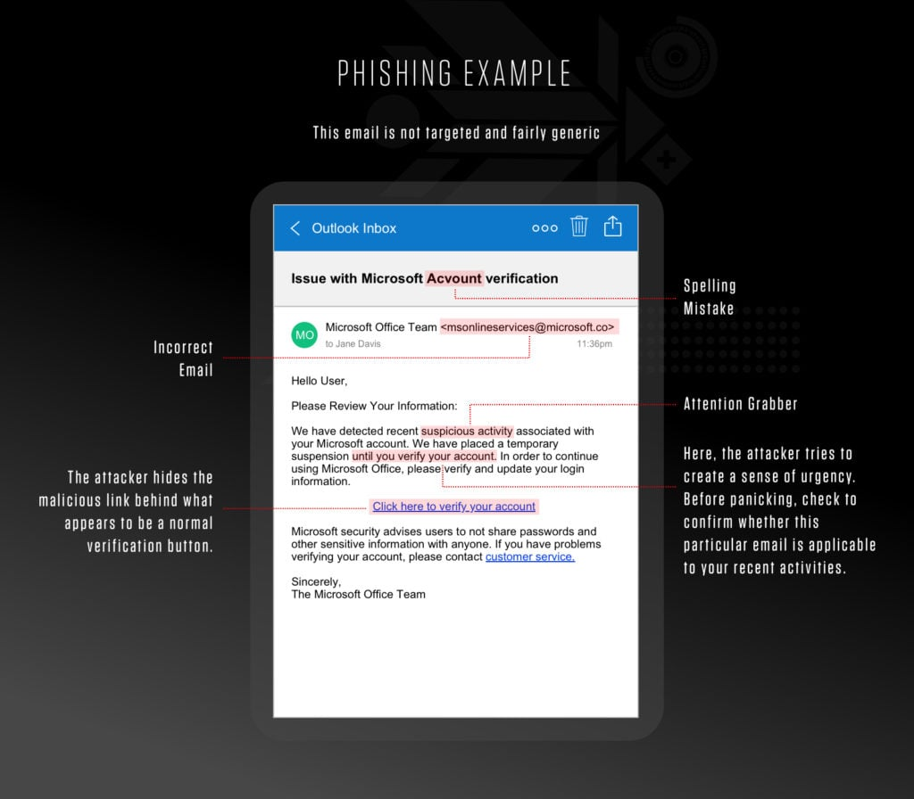

The Forage Mastercard Cybersecurity simulation

You are an analyst in our Security Awareness Team.

* Task One: Design a phishing email simulation

What you'll learn

    What threat phishing presents to an organization 
    What different types of phishing emails look like
    How Mastercard prevents and mitigates phishing threats

What you'll do

    Examine an obvious fake email and make it more believable 


syntax to create link in an email using [] and ()
To create a hyperlink in markdown, which can be used in some email systems that support markdown formatting, you would use the following syntax:

markdown
```
[Link Text](URL)
```
For example, if you wanted to create a link to Google, it would look like this:
markdown
```
[Google](https://www.google.com)
```
Anatomy of a phising email



How to spot a phishing email?

Phishing emails will typically contain at least one of the following telltale signs:

    Asks for Sensitive Information
    Uses a Different Domain
    Contains Links that Don't Match the Domain
    Includes Unsolicited Attachments
    Is Not Personalized
    Uses Poor Spelling and Grammar
    Tries to Panic the Recipient

read this article for more info
https://www.crowdstrike.com/en-us/cybersecurity-101/social-engineering/how-to-spot-a-phishing-email/

* Task Two: Interpret phishing simulation results

What you'll learn

    How to identify which areas of the business need more awareness about phishing
    How to design and implement the appropriate training for those teams to lower our risk of an attack

What you'll do

    Create a short presentation to help teams improve security awareness 


First, let’s have a look at the results of the phishing campaign.

This table helps you to identify which teams appear to be more likely to fall for a phishing email than others.
```
Team	Email open rate	Email click-through rate	Phishing success rate
IT	                80%	                      2%	                   0%
HR	               100%	                     85%	                  75%
Card Services	    60%	                     50%	                  10%
Reception        	40%                    	 10%	                   0%
Engineering	        70%	                      4%	                   1%
Marketing	        65%	                     40%	                  38%
R&D	                50%	                      5%	                   2%
Overall average	    66%	                     28%	                  18%
```
The percentages shown are based off the total number of staff members who received the email. 

For example if 100 people received the email and 50 people opened it - the email open rate would be 50%.

    Email open rate = the percentage of people that opened it
    Email click-through rate = the percentage of people that clicked on the link
    Phishing success rate = the percentage of people that clicked the link and inputted some personal information


Tips to prevent phishing
```
Phishing attacks can be quite deceptive, but with some vigilance and a few proactive measures, you can significantly reduce the risk of falling victim to them. Here are some tips to help you prevent phishing:

1. Be Skeptical of Unsolicited Communications:
Emails: Be cautious of emails from unknown senders, especially those asking for sensitive information or urging immediate action.

Links: Avoid clicking on links in unsolicited emails or messages. Hover over the link to see the actual URL before clicking.

Attachments: Don't open attachments from unknown or unexpected sources.

2. Verify the Source:
Sender's Email Address: Check the sender's email address carefully. Phishers often use addresses that look similar to legitimate ones.

Direct Contact: If you're unsure about an email or message, contact the company or individual directly using a known and trusted method.

3. Look for Signs of Phishing:
Spelling and Grammar: Phishing emails often contain spelling and grammatical errors.

Urgency: Be wary of messages that create a sense of urgency or fear, pressuring you to act quickly.

Generic Greetings: Legitimate companies usually address you by your name, not generic terms like "Dear Customer."

4. Use Two-Factor Authentication (2FA):
Extra Layer of Security: Enable 2FA on your accounts to add an extra layer of security. Even if your credentials are compromised, the attacker would need the second factor to access your account.

5. Educate Yourself and Others:
Training: Participate in cybersecurity awareness training to stay informed about the latest phishing tactics.

Awareness: Keep your family, friends, and colleagues informed about phishing and how to avoid it.

6. Check Website Security:
HTTPS: Ensure the website uses HTTPS, indicating a secure connection. Look for the padlock icon in the address bar.

Domain: Verify the website's domain carefully, as phishers often create look-alike domains.

7. Use Anti-Phishing Tools:
Browsers: Utilize built-in anti-phishing tools in browsers like Chrome, Firefox, and Edge.

Security Software: Install and update reputable antivirus and anti-phishing software.

8. Report Suspicious Activity:
Phishing Emails: Report phishing emails to your email provider and the company being impersonated.

Incident Reporting: Use the Anti-Phishing Working Group (APWG) or your country's cybersecurity agency to report phishing attempts.

9. Keep Software Updated:
Updates: Regularly update your operating system, browsers, and applications to patch vulnerabilities that phishers may exploit.
```
Awareness presentation templates

[Presentation template](<Potential presentation template Task 2 (3).pdf>)

[My version](<Presentation-my version.pdf>)

[Answer](<Task 2 - Model Answer - Slide Deck .pdf>)


* Finish Line

Interview Tips

Interview Tip
In a typical interview you’ll be asked “why are you interested in this role?” or “why are you interested in working at our company?”. Use this interview tip to explain why you want the job.
```
“Why are you interested in this role?”

I recently participated in Mastercard's job simulation on the Forage platform,
and it was incredibly useful to understand what it might be like to participate
on a Security Awareness team at Mastercard.
I worked on a project to identify phishing emails and design security awareness
training courses. Through this job simulation, I built my skills in
problem-solving, data analysis, and data presentation and practiced them in a
real-world context.
Doing this program confirmed that I really enjoy working in cybersecurity and
I'm excited to apply these skills on a Security Awareness team at a company like
Mastercard.
```
Resume Snippet

```
Mastercard Cybersecurity virtual experience program on Forage - December 2024

 * Completed a job simulation where I served as an analyst on Mastercard’s
   Security Awareness Team 
 * Helped identify and report security threats such as phishing 
 * Analyzed and identified which areas of the business needed more robust
   security training and implemented training courses and procedures for those
   teams
```

